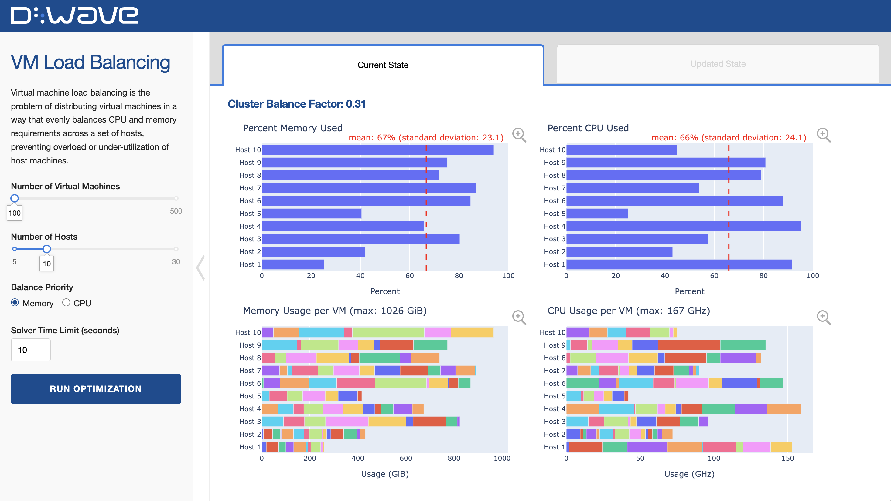

# Load Balancing

Virtual machine load balancing is the process of distributing virtual machine workloads across
a set of hosts in order to balance CPU and memory requirements across hosts, preventing any one
host from being overloaded. It is a real world problem that many organizations face, including
D-Wave.



## Installation
You can run this example without installation in cloud-based IDEs that support the
[Development Containers specification](https://containers.dev/supporting) (aka "devcontainers")
such as GitHub Codespaces.

For development environments that do not support `devcontainers`, install requirements:

```bash
pip install -r requirements.txt
```

If you are cloning the repo to your local system, working in a
[virtual environment](https://docs.python.org/3/library/venv.html) is recommended.

## Usage
Your development environment should be configured to access the
[Leap&trade; Quantum Cloud Service](https://docs.ocean.dwavesys.com/en/stable/overview/sapi.html).
You can see information about supported IDEs and authorizing access to your Leap account
[here](https://docs.dwavesys.com/docs/latest/doc_leap_dev_env.html).

Run the following terminal command to start the Dash app:

```bash
python app.py
```

Access the user interface with your browser at http://127.0.0.1:8050/.

The demo program opens an interface where you can configure problems and submit these problems to
a solver.

Configuration options can be found in the [demo_configs.py](demo_configs.py) file.

> [!NOTE]\
> If you plan on editing any files while the app is running,
please run the app with the `--debug` command-line argument for live reloads and easier debugging:
`python app.py --debug`

## Problem Description

**Objective**: To balance the system such that each host has similar memory and CPU demands.

**Constraints**: Each virtual machine can only be assigned to one host and the total resource
demands on a single host must be less than or equal to the proportional allocation of virtual
machine resource demands on hosts subject to the host's capacity.

## Model Overview

### Parameters
 - Hosts: Each with an ID, current CPU use, current memory use, CPU capacity, and memory capacity.
 - Virtual Machines: Each with an ID, CPU requirement, and memory requirement.
 - Priority: Whether to prioritize balancing CPU or memory.

### Variables
 - `{vm}_on_{host}`: Binary variable that shows if vm is assigned to host.

### Objective
Our objective is to assign virtual machines to hosts such that the resource demands for CPU and
memory are equally distributed between hosts.

The `Priority` setting allows the option to switch between prioritizing balancing CPU or memory. The
resource chosen as priority will be set as a hard constraint while the other resource will be a
soft constraint.

### Constraints
#### One Host per Virtual Machine Constraint
Each virtual machine can only be assigned to one host. To accomplish this we use a one-hot
constraint for discrete `{vm}_on_{host}` variables.

#### Proportional Allocation Constraint
The sum of CPU requirements and memory demands on a host must be less than or equal to the
proportionally balanced CPU and memory calculated by taking the host's individual resource capacity
and multiplying it by the total requested resource (of all virtual machines), divided by the total
available space across all hosts for that resource.

The priority of which resource (memory or CPU) to balance can be set by the `Balance Priority` which
switches between hard and soft constraints for the two resources.


## License

Released under the Apache License 2.0. See [LICENSE](LICENSE) file.
